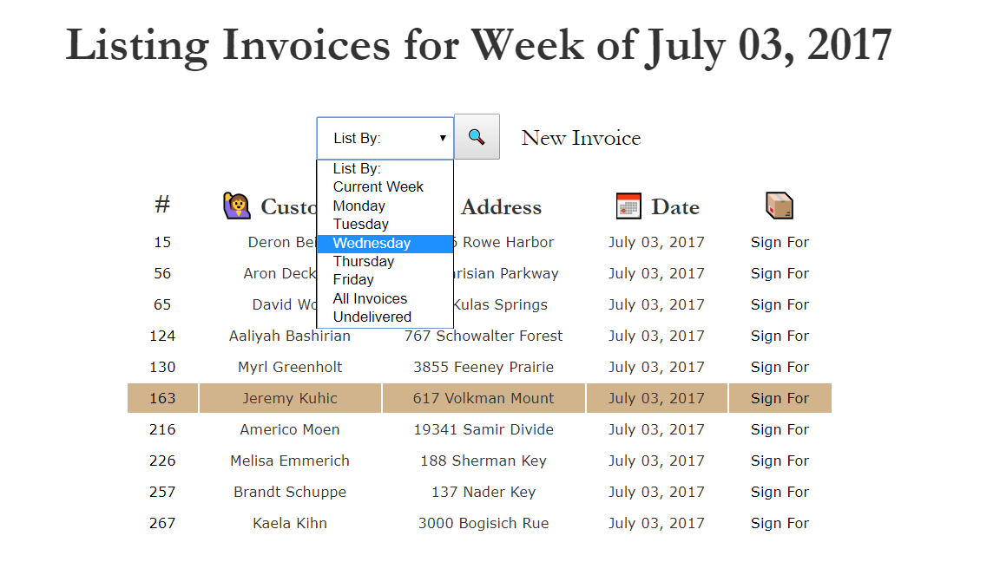
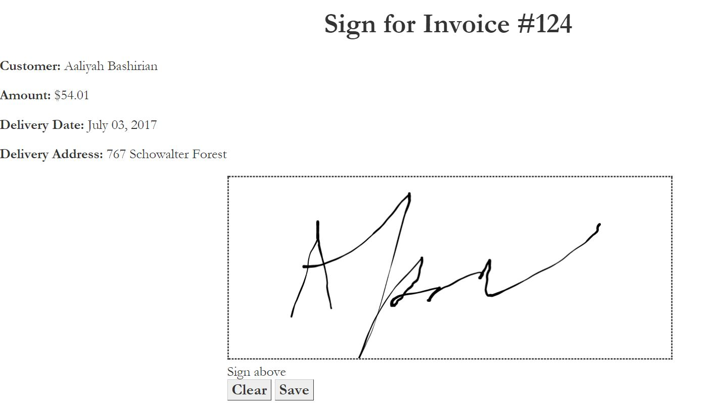
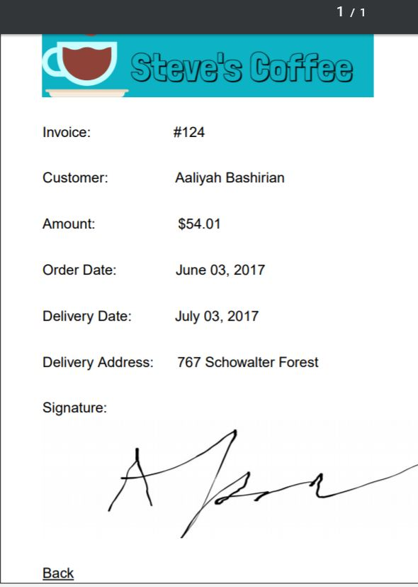

# :mailbox_closed: Steve's Coffee :mailbox_closed:

This is an invoicing app that allows users to sort upcoming deliveries by days of the week (using Active Support's datetime methods) or by undelivered. A user can sign for the invoice using a Javascript signature pad that tracks HTML5 cursor drag, and can export the invoice to PDF format using Prawn.

## [View Demo and Documentation &rarr;](http://limhjosh.github.io)

### Each row lights up when hovered, and acts as a link. Sign For is a unique link:

### The Sign For link takes you to the Signature Pad:

### And you can view a PDF version of the invoice:

